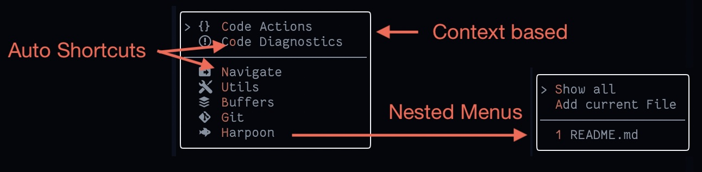

<!-- panvimdoc-ignore-start -->

# ConMenu

Powerful but minimal context menu for neovim.



<!-- panvimdoc-ignore-end -->

# Features

 - Quick and easy way to build menus & submenus with automatic hotkey bindings
 - Appears next to your cursor (you are probably looking there anyways!)
 - Context based (optionally based on the filetype or custom filter function)
 - Icon unicode support (via dev icons, you need patched fonts)
 - Configure with Vimscript or Lua

Opinionated / optional / language specific features:

 - Helpers for NPM projects and Lerna monorepos
 - Helpers for git worktree workflows

# Requirements

 - Neovim (tested with v0.5.0)

Optional 1/2:
if you want better integration with javascript ecosystem. Specifically for `fromNpm` and `fromLerna`:

 - [vim-dispatch](https://github.com/tpope/vim-dispatch) - For dispatching
   jobs in the background
 - [jq](https://github.com/stedolan/jq) - For parsing package.json
 - yarn - I'll make this configurable at some point so you can use NPM instead

Optional 2/2:
[git-worktree.nvim](https://github.com/ThePrimeagen/git-worktree.nvim) - If you are going to be using `createWorktree`, `selectWorktree`, `removeWorktree`.

<!-- panvimdoc-ignore-start -->

# Installation

Plug with vimscript:
```vim
Plug 'meznaric/conmenu'

" Configure ConMenu
let g:conmenu#shortcut_highlight_group = "KeyHighlight";
```

Lazy.nvim with lua:
```lua
{
	"meznaric/conmenu",
    init = function()
        -- Configure it in "init"
        vim.api.nvim_set_keymap("n", "<leader>", ":ConMenu<CR>", { silent = true })
        vim.g["conmenu#default_menu"] = {...}
        vim.api.nvim_set_hl(0, "KeyHighlight", { fg = "#569CD6" })
        vim.g["conmenu#shortcut_highlight_group"] = "KeyHighlight"
    end,
}
```

Feel free to open a pull request if you have install instructions for other systems.

<!-- panvimdoc-ignore-end -->

# Usage

### Commands
```
" You probably only need this one
:ConMenu
" These commands are used by binds inside a menu
:ConMenuNext
:ConMenuPrevious
:ConMenuConfirm
:ConMenuClose
:ConMenuUpdateRender
```

# Configuration

See [example below](#example) if you just want a quick start.

**Menu**

In the documentation below `Menu` represents the array of `MenuItem`s.

**MenuItem**

Which is defined as an array of 3 items:

 - `Name` is the name of the entry in the menu list. What you see.
 - `Menu` or command or a lua function
 - `Options` defines when `MenuListItem` is shown. If you define multiple options
    for example `onlyTypes` and `onlyWorkingDirectories` it will show the menu list
    item only when both conditions are true, *not* when either is true. This is
    optional. Menu items will be always shown if options are not defined.

**Options**

 - `onlyTypes` array of file types
 - `filter` global lua or vimscript function, if it returns true, menu item will be shown
 - `onlyWorkingDirectories` array of path globs. If current working directory
    matches any of the globs then the MenuItem will be shown.
 - `onlyBufferPaths` array of path globs. If current buffer path matches any of the
    globs then the MenuItem will be shown. Empty glob `''`, will match :new buffer.

### Vimscript Reference

```
function! AlwaysShow()
  " Check if in the right folder, or the path is right, or whatever...
  return v:true
endfunction

let s:onlyProjectFolders = [ '/Users/otiv/Projects/*' ]
let s:onlyTsFiles = [ '*.ts' ]
let s:myFileTypes = ['typescript', 'typescriptreact']
let s:myOptions = {
  \ 'onlyTypes': s:myFileTypes,
  \ 'filter': 'AlwaysShow',
  \ 'onlyWorkingDirectories': s:onlyProjectFolders,
  \ 'onlyBufferPaths': s:onlyTsFiles,
  \ }

let s:menuItem = [name, commandOrMenu, s:myOptions]
let s:nestedMenu = [name, [s:menuItem, s:menuItem], s:myOptions]
let s:divider = ['──────────────────────────', v:null, s:myOptions]

let g:conmenu#default_menu = [menuItem, divider, menuItem, nestedMenu]
```

### Lua Reference

```lua
function AlwaysShow()
  -- Check if in the right folder, or the path is right, or whatever...
  return true
end

local options = {
  onlyTypes = { 'typescript', 'typescriptreact' },
  onlyBufferPaths: { path1, path2 },
  onlyWorkingDirectories: { path3, path4 },
  filter = 'AlwaysShow',
}
local menuItem = {name, ":echo hey", options}
local nestedMenu = {name, {menuItem, menuItem}, options}
local divider = {'──────────────────────────', nil, options}
local callbackExample = {
    'Press Me',
    function() 
        print("Pressed!")
    end
}

vim.g['conmenu#default_menu'] = { menuItem, divider, menuItem, nestedMenu }
```

## Global Conmenu Options

```vim
" Default menu that opens when you execute ConMenu
let g:conmenu#default_menu = [];

" Only these keys will be bound if found in menu item name
" If you want to use numbers for shortcuts too extend this
let g:conmenu#available_bindings = 'wertyuiopasdfghlzxcvbnm';

" > is the default, but you can use - or something else.
" Note: unicode characters have different width and we do not consider this yet, so shortcut highlights will be off
" Use only normal 1 byte characters, such as `-`, `~`
let g:conmenu#cursor_character = '>';

" We use simple Popup Buffer, so NormalFloat and FloatBorder define the colors
" On top of that create a new highlight group shortcut_highlight_group
let g:conmenu#shortcut_highlight_group = 'KeyHighlight';

" These options are just passed on to nvim_open_win:
" border values: none, single, double, rounded, solid, shadow
let g:conmenu#border = 'rounded';
" relative values: cursor, mouse, win, editor
let g:conmenu#relative = 'cursor'
let g:conmenu#row = get(g:, 'conmenu#row', 0)
let g:conmenu#col = get(g:, 'conmenu#col', 0)

" Not yet implemented
let g:conmenu#close_keys = ['q', '<esc>']
let g:conmenu#js#package_manager = 'yarn'
```


## API
```
" Opens default menu (defined at g:conmenu#default_menu)
open()
" Opens custom menu
openCustom(menu, window_options)
close()

executeItem()
switchItem(number)

-- Javascript helpers
fromNpm()
fromLerna()

-- Git Worktree helpers
createWorktree()
removeWorktree()
selectWorktree()

-- Used by bindings generated by this script
executeItemNum()
updateRender()
```

# Integrations

## JavaScript integration

Requires [jq](https://github.com/stedolan/jq) so we can parse what scripts there
are in package.json. There is a built in filter `IsInNodeProject`, that you can
use to hide this menu if not inside a node project.

 - Use `fromLerna` to see a list of projects / packages
 - Use `fromNpm` to see a list of available scripts in package.json

### Example
```
let g:conmenu#default_menu = [
  \['Scripts', ":lua require('conmenu').fromNpm()",
    \{ 'filter': 'IsInNodeProject' }],
  \['Lerna Projects', ":lua require('conmenu').fromLerna()",
    \{ 'filter': 'IsInNodeProject' }],
\]
```

## git-worktree.nvim integration


Requires [git-worktree.nvim](https://github.com/ThePrimeagen/git-worktree.nvim).
There are 3 methods for you to use `createWorktree()`, `selectWorktree()` and
`removeWorktree()`. On top of that there is a built in filter "IsInGitWorktree",
that you can use so this menu item is shown only when you are editing inside git repositroy.

### Example
```
let g:conmenu#default_menu = [
  \['Git', [
    \['Status', ':Git'],
    \['Blame', ':Git blame'],
    \['Why', ':GitMessenger'],
    \['────────────────────────────'],
    \['Create Worktree', ":lua require('conmenu').createWorktree()"],
    \['Select Worktree', ":lua require('conmenu').selectWorktree()"],
    \['Remove Worktree', ":lua require('conmenu').removeWorktree()"],
    \], { 'filter': 'IsInGitWorktree' }],
  \]
```

# Example

Here is the example of how I use it, it depends on bunch of other plugins so don't expect to
copy and paste as it's not going to work.

I'll try to breakdown important lines here.

Show menu item or nested menu item only in specific file types.
```
\['  Code Diagnostics',[
  ...
  \], { 'onlyTypes': s:javascriptTypes }],
```


Is `IsInNodeProject` and `IsInGitWorktree` are built in filters that you can use 
in combination with few helper functions explained above.
```
\['  Scripts', ":lua require('conmenu').fromNpm()",
  \{ 'filter': 'IsInNodeProject' }],
```

Shows an example of how to build a custom menu.
The function itself is called from Harpoon menu item at the bottom.
```
function ShowHarpoonMenu()
```

Use this to get some ideas what you can do:
```vim
" Map <leader>m to open default menu.
noremap <silent> <leader>m :ConMenu<CR>

" Some of the menu items should only be available in javascript files
let s:javascriptTypes = ['typescriptreact', 'typescript', 'javascript', 'javascript.jsx', 'json']
" By default numbers are not bound, but we we want to bind numbers too
let g:conmenu#available_bindings = '1234567890wertyuiopasdfghlzxcvbnm'

" This generates a new menu programatically
function ShowHarpoonMenu()
  local marks = require("harpoon").get_mark_config().marks;
  local marksCount = table.maxn(marks)
  -- Default entries, that are always shown
  local menuEntries = {
    { 'Show all', ':lua require("harpoon.ui").toggle_quick_menu()' },
    { 'Add current File', ':lua require("harpoon.mark").add_file()' },
  };
  -- Add divider if we have marks
  if (marksCount > 0) then
    table.insert(menuEntries, { '────────────────────────────'})
  end

  -- Prepare navigation marks
  for i,v in ipairs(marks) do
    -- Get just the filename from entire path
    local file = string.match("/" .. v.filename, ".*/(.*)$")
    -- Add menu entry
    table.insert(menuEntries, {i .. " " .. file, "lua require('harpoon.ui').nav_file(".. i ..")"})
  end
  -- Show menu
  require('conmenu').openCustom(menuEntries)
end
END

" Find icons here: https://www.nerdfonts.com/cheat-sheet
let g:conmenu#default_menu = [
\['  Code Actions', [
  \['  Rename', ":call CocActionAsync('rename')"],
  \['  Fix', ':CocFix'],
  \['  Cursor', ":call CocActionAsync('codeAction', 'cursor')"],
  \['  Refactor', ":call CocActionAsync('refactor')"],
  \['  Selection', "execute 'normal gv' | call CocActionAsync('codeAction', visualmode())"],
  \['  Definition', ":call CocActionAsync('jumpDefinition')"],
  \['  Declaration', ":call CocActionAsync('jumpDeclaration')"],
  \['  Type Definition', ":call CocActionAsync('jumpTypeDefinition')"],
  \['  Implementation', ":call CocActionAsync('jumpImplementation')"],
  \['  References', ":call CocActionAsync('jumpReferences')"],
  \['  Usages', ":call CocActionAsync('jumpUsed')"],
  \['  Test Nearest', ':TestNearest'],
  \['﬍  File Outline', ':CocOutline'],
  \['   Format File', ':PrettierAsync'],
  \['   UnMinify JS', ':call UnMinify()'],
  \['   Organise Imports', ":call CocAction('organizeImport')"],
  \], { 'onlyTypes': s:javascriptTypes }],
\['  Code Diagnostics',[
  \['  List Diagnostics', ':CocList diagnostics'],
  \['  Previous', ":call CocActionAsync('diagnosticPrevious')"],
  \['  Next', ":call CocActionAsync('diagnosticNext')"],
  \['  Info', ":call CocActionAsync('diagnosticInfo')"]
  \], { 'onlyTypes': s:javascriptTypes }],
\['  Scripts', ":lua require('conmenu').fromNpm()",
  \{ 'filter': 'IsInNodeProject' }],
\['  Lerna Projects', ":lua require('conmenu').fromLerna()",
  \{ 'filter': 'IsInNodeProject' }],
\['────────────────────────────', v:null, { 'onlyTypes': s:javascriptTypes}],
\['  Navigate', [
  \['  Fuzzy', ':Files'],
  \['  Recent Files', ':CtrlPMRUFiles'],
  \['  Mixed', ':CtrlPMixed'],
  \['  Marks', ':Marks' ],
  \['────────────────────────────'],
  \['﬍  Explorer', ':CocCommand explorer'],
  \['﬍  Highlight in Explorer', ':CocCommand explorer --reveal'],
  \['  Lines in file', ':CocList outline'],
  \]],
\['  Utils', [
  \['  Git', ':call ToggleTerm("lazygit")', { 'filter': 'IsInGitWorktree' }],
  \['  Docker', ':call ToggleTerm("lazydocker")'],
  \['  Databases', ':DBUI'],
  \['  Terminal', ':terminal'],
  \['  Dev Docs', ":call devdocs#open(expand('<cword>'))"],
  \['  Help', ':call ShowDocumentation()'],
  \['────────────────────────────'],
  \['  Delete All Marks', ':delmarks A-Z0-9a-z'],
  \['  Configs', [
    \[' neovim', ':e ~/.config/nvim/init.vim'],
    \[' zsh', ':e ~/.zshrc'],
    \[' coc.nvim', ':CocConfig'],
    \]],
  \['────────────────────────────'],
  \['  Buffer in Finder', ':silent exec "!open %:p:h"'],
  \['  Project in Finder', ':silent exec "!open $(pwd)"'],
  \['פּ  TreeSitter Playground', ':TSPlaygroundToggle'],
  \]],
\['﬘  Buffers', [
  \['﬘  Show All', ':Buffers'],
  \['﬘  Close All', ':silent bufdo BD!'],
  \]],
\['  Git', [
  \['Status', ':Git'],
  \['Blame', ':Git blame'],
  \['Why', ':GitMessenger'],
  \['────────────────────────────'],
  \['Create Worktree', ":lua require('conmenu').createWorktree()"],
  \['Select Worktree', ":lua require('conmenu').selectWorktree()"],
  \['Remove Worktree', ":lua require('conmenu').removeWorktree()"],
  \], { 'filter': 'IsInGitWorktree' }],
\['  Harpoon', ':lua ShowHarpoonMenu()'],
\]
```
